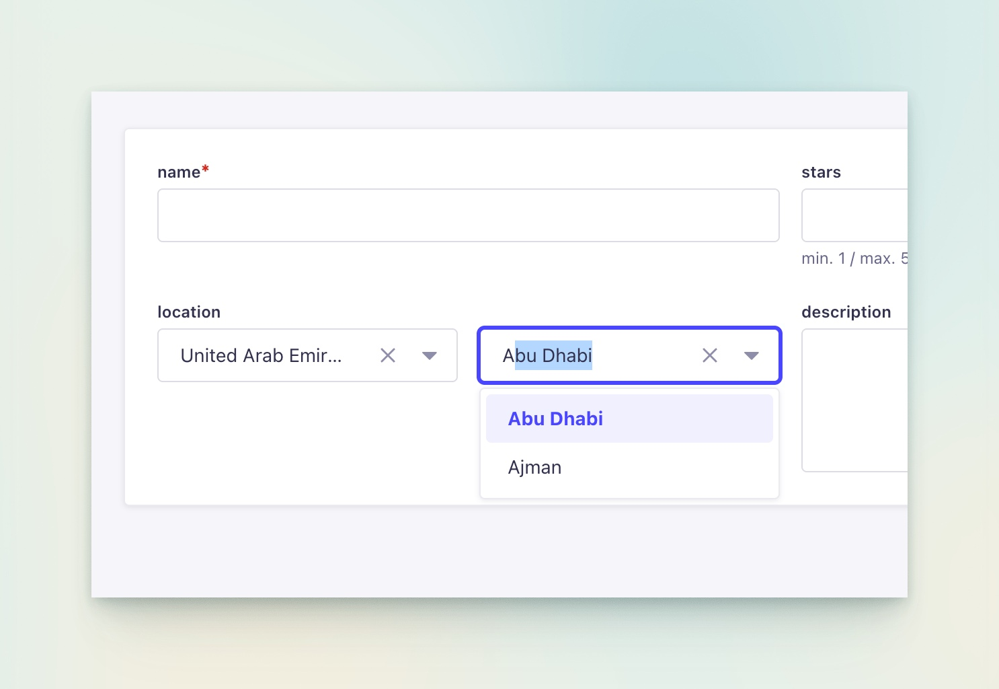
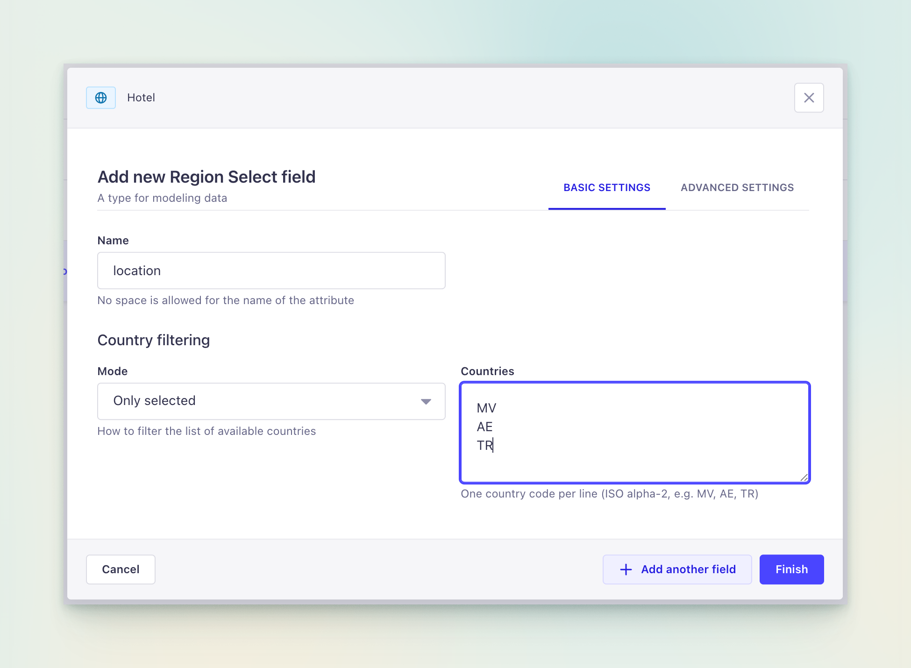

<p align="center">
  
</p>

# Strapi Plugin Region

Cascading **Country → Region** selector as a Strapi 5 custom field. Pick a country, then pick a region — stored as structured JSON, auto-parsed in API responses.

[](LICENSE)
[](https://strapi.io)

<p align="center">
  
</p>

## Features

- Two-stage cascading selector: **Country → Region** with autocomplete
- Country filtering: show **all**, **only selected**, or **all except selected** countries
- ISO 3166-1 alpha-2 country codes with full country and region datasets
- Stored as a single `string` field — no extra tables or relations
- Automatic JSON parsing in API responses (Koa middleware)
- Formatted **"Country, Region"** column in Content Manager list view

## Installation

```bash
npm install @hitkey-io/strapi-plugin-region
```

Or with yarn:

```bash
yarn add @hitkey-io/strapi-plugin-region
```

## Configuration

<p align="center">
  
</p>

### Adding the field

1. Open the **Content-Type Builder**
2. Add a new **Custom** field → **Region Select**
3. Configure country filtering:

| Option | Description |
|--------|-------------|
| **All countries** | Show every country in the selector (default) |
| **Only selected** | Show only the listed country codes |
| **All except selected** | Show all countries except the listed ones |

Country codes are entered one per line in ISO alpha-2 format (e.g. `US`, `TR`, `AE`).

### Plugin config

No additional plugin configuration is needed. The plugin works out of the box once installed.

## Stored value format

The field stores a JSON string in the database:

```json
{ "country": "AE", "region": "AZ" }
```

### API response

The plugin automatically parses stored JSON strings into objects in all `/api/*` responses via Koa middleware:

```json
{
  "data": {
    "id": 1,
    "name": "Burj Al Arab Jumeirah",
    "location": {
      "country": "AE",
      "region": "AZ"
    }
  }
}
```

No extra configuration or population is required — it works automatically for all content types using the Region Select field.

## Compatibility

| Requirement | Version |
|-------------|---------|
| Strapi | 5.x |
| Node.js | 20+ |

## License

[MIT](LICENSE)
